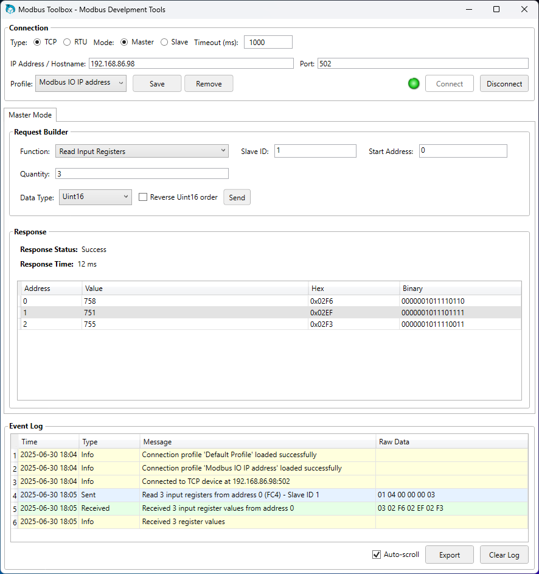
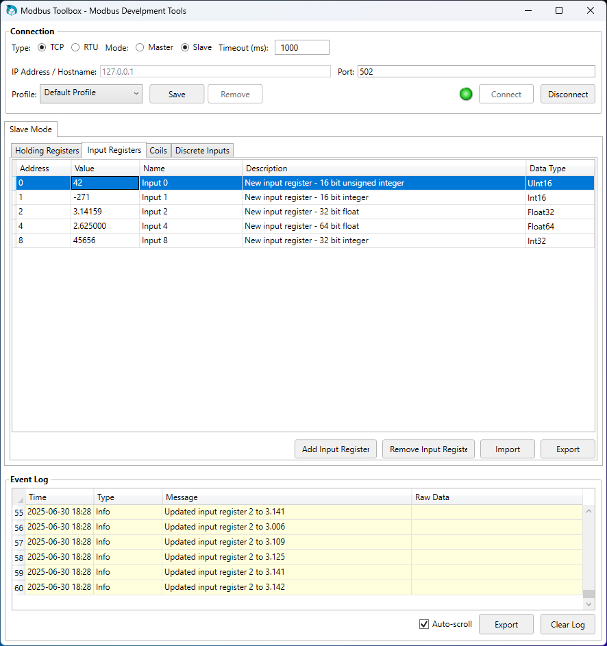
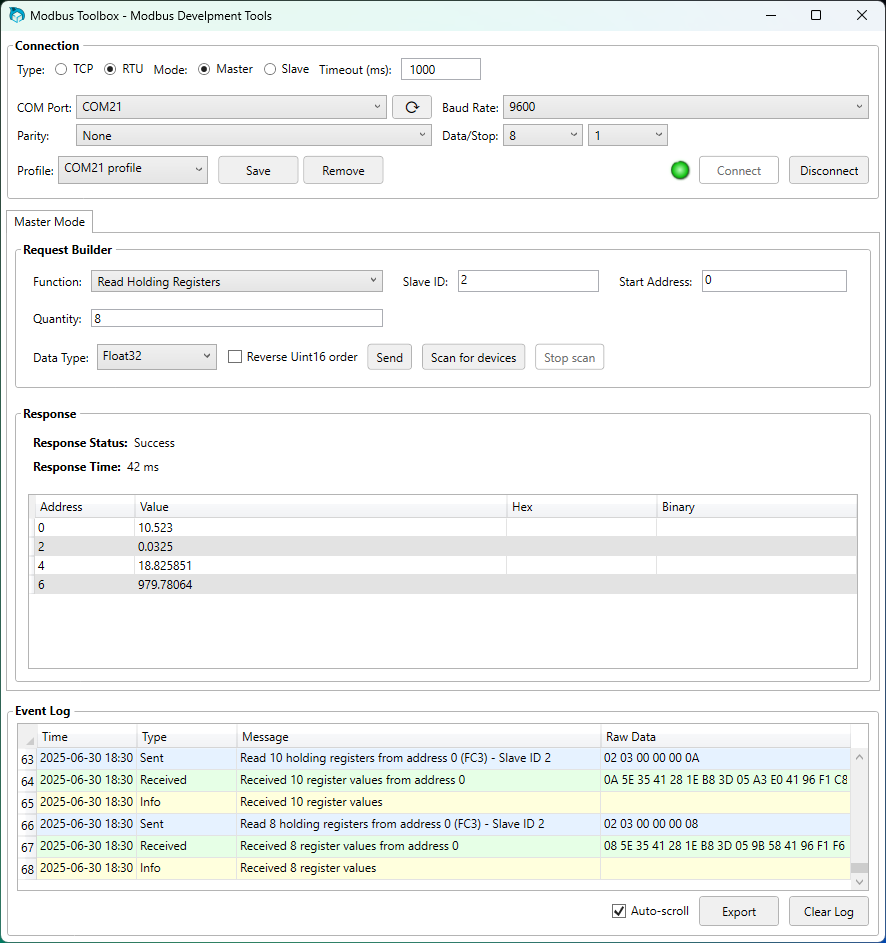
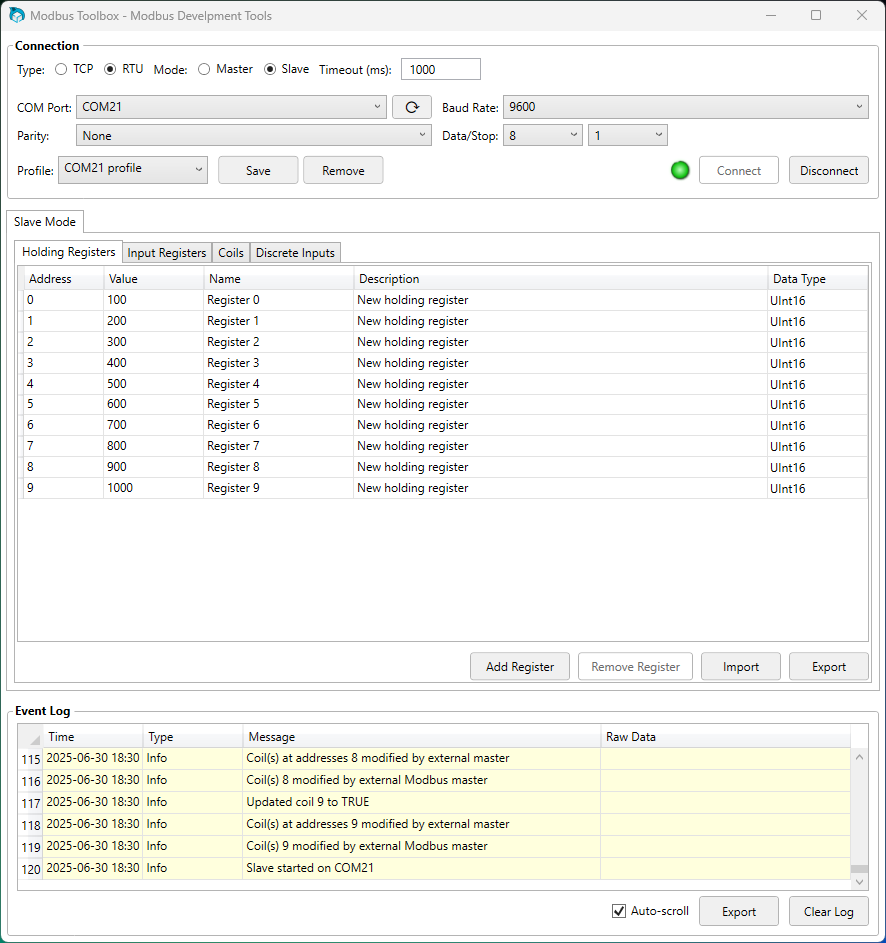

# ModbusTerm

A comprehensive Modbus testing application supporting both TCP and RTU connections with master and slave device functionality. ModbusTerm provides an easy-to-use interface for testing, debugging, and simulating Modbus devices in industrial automation environments.

## Version 1.0.0

Released on 2025-06-30, the very first version! Probably a few bugs - please report them to me! Some known issues:

- Register configuration in slave doesn't like registers being added once the slave server is started (Connect is clicked). Workaround - add registers, ignore complaints, navigate away from slave mode and then back before updating your register values and hitting Connect again.
- ASCII data type is still a work in progress, hoping to have this implemented properly in the next version.

## Features

- **Dual Connection Types**: Support for both Modbus TCP (network-based) and Modbus RTU (serial-based) connections
- **Master/Slave Modes**: Function as either a Modbus master (client) or slave (server) device
- **Connection Profiles**: Save and load connection settings with profile management
- **Data Visualization**: View and interact with Modbus registers in various data formats (UInt16, Int16, UInt32, Int32, Float32, Float64)
- **Byte Order Options**: Support for standard Modbus LSB-first order and optional MSB-first order for compatibility with different devices
- **Real-time Monitoring**: Track communication events through an integrated event log
- **Register Management**: Define and manage custom register configurations
- **Device Scanning**: Scan for RTU devices on the network to detect active slave IDs

## Screenshots

### TCP Master Mode

*TCP Master mode for sending requests to Modbus TCP servers*

### TCP Slave Mode

*TCP Slave mode for simulating a Modbus TCP server with configurable registers*

### RTU Master Mode

*RTU Master mode for communicating with serial Modbus devices*

### RTU Slave Mode

*RTU Slave mode for simulating a Modbus RTU device over serial connection*

## Connection Options

### TCP Mode
- IP Address/Hostname configuration
- Custom port settings (default: 502)
- TCP Master and TCP Slave functionality
- Slave ID configuration

### RTU Mode
- COM port selection and configuration
- Adjustable baud rate, parity, data bits, and stop bits
- RTU Master and RTU Slave functionality
- Device scanning capability
- COMMING SOON: Support for custom baud rates

## Master Mode Features

- Support for all standard Modbus functions:
  - Read Coils (01)
  - Read Discrete Inputs (02)
  - Read Holding Registers (03)
  - Read Input Registers (04)
  - Write Single Coil (05)
  - Write Single Register (06)
  - Write Multiple Coils (15)
  - Write Multiple Registers (16)
- Configurable start address and quantity for read operations
- Multiple data type display options for register values:
  - UInt16, Int16 (single register values)
  - UInt32, Int32, Float32 (double register values)
  - Float64 (quad register values)
  - Hex and Binary display
- Reverse register order option for compatibility with non-standard Modbus implementations
- Customisable request parameters

## Slave Mode Features

- Configurable register tables:
  - Holding Registers (read/write)
  - Input Registers (read-only)
  - Coils (read/write boolean)
  - Discrete Inputs (read-only boolean)
- Register management with address, name, description, and data type properties
- Value modification with real-time updates
- Import/Export register configurations
- Individual data type selection for each register

## Profile Management

- Save and load connection profiles
- Default profile auto-loading on startup
- Quick switching between saved configurations
- Protection for the Default Profile

## Usage

1. Select your connection type (TCP or RTU)
2. Configure appropriate connection parameters
3. Select master or slave mode
4. Connect to your Modbus device
5. Send requests (master mode) or respond to incoming requests (slave mode)
6. View response data in your preferred format
7. Save your configuration as a named profile for future use

## Tip

Want to test it out but don't have any modbus devices to test with? Run two instances of Modbus Toolbox in TCP mode, one as master and one as slave. You can play around with different register structures and data types, send and receieve data, and see what the raw data bytes look like in the event log.

## Technical Details

- Built with .NET 7 and C#
- Uses NModbus library for Modbus protocol implementation
- MVVM architecture pattern
- WPF-based user interface
- Serializable profiles for configuration persistence

## License

Copyright (c) 2025 Peake Electronic Innovation

Permission is hereby granted, free of charge, to any person obtaining a copy
of this software and associated documentation files (the "Software"), to deal
in the Software without restriction, including without limitation the rights
to use, copy, modify, merge, publish, distribute, sublicense, and/or sell
copies of the Software, and to permit persons to whom the Software is
furnished to do so, subject to the following conditions:

The above copyright notice and this permission notice shall be included in all
copies or substantial portions of the Software.

THE SOFTWARE IS PROVIDED "AS IS", WITHOUT WARRANTY OF ANY KIND,
EXPRESS OR IMPLIED, INCLUDING BUT NOT LIMITED TO THE WARRANTIES OF
MERCHANTABILITY, FITNESS FOR A PARTICULAR PURPOSE AND NONINFRINGEMENT.
IN NO EVENT SHALL THE AUTHORS OR COPYRIGHT HOLDERS BE LIABLE FOR ANY CLAIM,
DAMAGES OR OTHER LIABILITY, WHETHER IN AN ACTION OF CONTRACT, TORT OR
OTHERWISE, ARISING FROM, OUT OF OR IN CONNECTION WITH THE SOFTWARE OR THE USE
OR OTHER DEALINGS IN THE SOFTWARE.